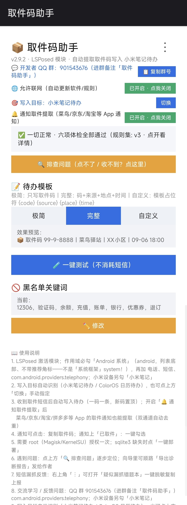
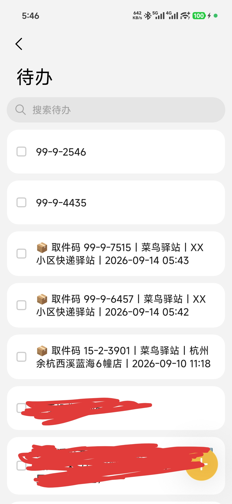
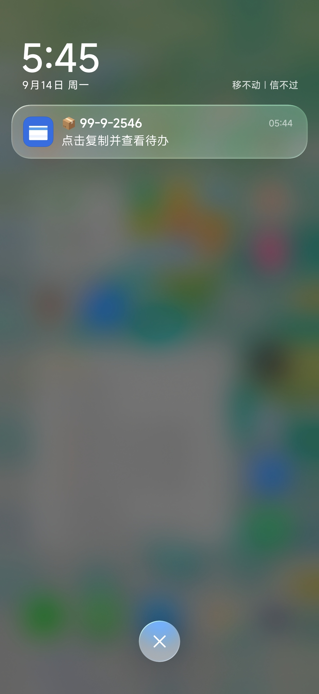
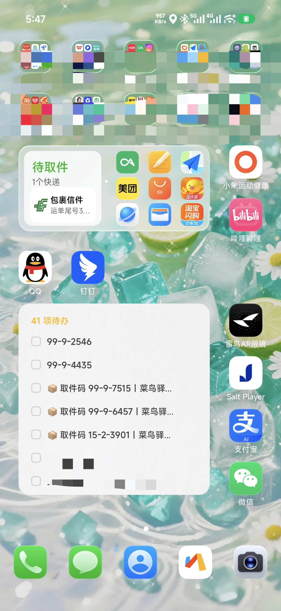

# 取件码助手（PickupCodeGrabber）


[](https://github.com/O-kai/Xiaomi-HyperOs-pickup-code-grabber/releases)

💬 **开发者 QQ 群：901543676**（反馈问题 / 交流学习；进群请备注 **"取件码助手"**）

📱 **酷安发布帖**：[取件码助手 · 自动提取快递取件码写入小米笔记待办](https://www.coolapk.com/feed/73558591?s=ZTFhMTFhMDMxMmE4ZjhnNmE5OGQxYjV6a1661)
（更新动态会在酷安同步；欢迎 ⭐ Star）

🧩 **LSPosed 官方模块仓库已上架**：LSPosed 管理器内即可搜索安装/更新「取件码助手」，
仓库页：[Xposed-Modules-Repo/io.github.okaidev.pickupcode](https://github.com/Xposed-Modules-Repo/io.github.okaidev.pickupcode)
（模块页：[modules.lsposed.org](https://modules.lsposed.org)，Release 与本仓库自动同步）

> 一个 **LSPosed 模块**：自动捕获快递取件短信 → 提取取件码 → 写入小米笔记「待办」
> （一码一条、新码堆栈置顶）→ 弹出通知（点击复制 / 一键标记已取件）。
>
> 适用于 **小米 / 红米（MIUI·HyperOS）+ Root + LSPosed** 环境。

**[English summary]** An LSPosed module for Xiaomi/HyperOS that automatically extracts parcel
pickup codes from SMS and writes each code as a to-do item in Xiaomi Notes, with copy-on-tap
notifications. Requires root (Magisk) + LSPosed; tested on HyperOS 4.0 / Android 17.

---

## ✨ 特性

- **100% 覆盖短信来源**：在短信数据库的写入必经点（`SmsProvider.insert`）捕获，
  普通短信与小米网络短信都逃不掉；
- **智能提取**：支持「取件码为 16-4-9626, 15-3-2194」「凭22-2-3579到…取件」等多种真实短信格式，
  支持一条短信内多码簇提取；来源识别（菜鸟/丰巢/京东/顺丰/中通/圆通/韵达/申通/邮政）；
- **去重**：按「取件码 + 地点」指纹去重，同一地点的同一码不会重复写入；
- **一码一条待办**：写入小米笔记待办，`custom_sort_id = MAX + 0x100000` 新码堆栈置顶；
- **通知交互**：通知正文显示取件码，点击 → 复制到剪贴板 + 打开笔记待办；每条码带「已取件」动作按钮；
- **三种模板**（v2.6.0 重构）：极简（仅码）/ 完整（码+来源+地点+时间，默认）——
  均为只读效果预览；自定义占位符模板（`{code}` `{source}` `{place}` `{time}`），
  编辑 + 保存 / 恢复默认，保存带校验（必须含 `{code}`，最长 500 字）；
- **黑名单关键词**：过滤 12306 / 验证码 / 银行 / 广告等误报短信（设置页可预览、修改）；
- **一键自测**：设置页一键注入测试短信（随机取件码，永不去重撞车），验证链路，不消耗真实短信；
- **部署体检 + 诊断报告**（v2.1.2+）：App 内六项体检（LSPosed 注入 / root / **LSPosed 作用域自动比对** /
  **通知权限** / sqlite3 / 笔记库），一键导出自动脱敏的诊断报告（含 PICKUPDEBUG 日志、LSPosed 模块日志、
  注入进程清单），出问题一步收集，发给作者即可；
- **界面大修**（v2.6.0）：体检全绿自动收起一行「✅ 一切正常」（点开看详情，有问题自动展开）；
  模板切换与体检解耦（不再无谓重跑）；QQ 群入口置顶（群号明文 + 一键复制）；
- **一键部署 sqlite3**（v2.2.0）：APK 内置经实机验证的 sqlite3（arm64），体检发现缺失时一键自动部署，
  告别 adb/Termux 手工操作；
- **🔍 排查问题向导**（v2.5.0）：按「未注入 → root 授权 → 作用域 → 通知 → sqlite3（自动修复）→ 笔记库」
  六层决策树逐层定位，每层给出可执行动作（一键直达 LSPosed / Magisk），能自动修的自动修；
  顺路导出诊断报告 / GitHub Issues / 酷安反馈；
- **检查更新**（v2.5.1）：默认每 3 天最多 1 次访问 GitHub Releases API，发现新版本弹窗直达下载页；
  右上角「⋮」菜单可手动检查，另含项目仓库 / 打赏作者入口；
- **隐私友好**：**零短信权限**（不申请 READ_SMS/RECEIVE_SMS，Hook 层直接取数），全程本地处理，
  不收集任何数据；应用仅有的联网行为是「检查更新」（默认每 3 天最多 1 次访问 GitHub
  Releases API，v2.5.1 起，可在系统设置禁用网络后无影响）。

> 🔮 **下一步计划**：通知信息分析与取件码读取——让取件方式更多样。
> 想聊使用场景 / 提需求？QQ 群 **901543676**（进群备注「取件码助手」）。

## 📷 效果截图

**设置页**（模块激活状态 · 模板三档 · 一键测试 · 黑名单 · 使用说明）



**小米笔记待办列表**（一码一条、新码置顶；测试用随机码已验证，真实记录已脱敏）



**取件通知**（点击复制并打开待办）



**桌面演示**（系统原生「待办」桌面组件，直接展示模块写入的取件码 —— 无需打开笔记即可查看）



## 🔄 工作原理

```
短信（普通 / 小米网络短信）
   ↓ ① 捕获：Hook SmsProvider.insert / bulkInsert（短信库写入必经点，100% 覆盖）
   ↓ ② 拼接与转发：ContentResolver.call → 模块 App（Provider 唤醒，不受后台冻结限制）
   ↓ ③ 提取：正则引擎（关键词锚定 / 凭…到 / 快递特征词，支持多码簇）
   ↓ ④ 去重：码 + 地点指纹（模块自有 SharedPreferences）
   ↓ ⑤ 写入：su -M sqlite3 直写 小米笔记 todo.db（custom_sort_id=MAX+0x100000 堆栈置顶）
   ↓ ⑥ 通知：点击复制取件码 + 打开待办；动作按钮「已取件」
```

多点冗余 Hook（S1–S8，详见 [docs/14-hooks.md](docs/14-hooks.md)）保证不同 ROM 版本都能兜底，
`S8`（短信库写入点）是主通道。

## 📋 环境要求

| 项目 | 要求 |
|---|---|
| 设备 | 小米 / 红米，MIUI / HyperOS（Android 12+；实测见兼容矩阵） |
| Root | Magisk（需要 `su -M`，即全局挂载命名空间） |
| 框架 | LSPosed（Zygisk 或原版均可） |
| 手机端工具 | `sqlite3` 可执行文件（见「部署准备」） |
| 备注 | 待办写入依赖小米笔记 App（`com.miui.notes`），**非小米设备不适用** |

## 🚀 安装

1. **下载 APK**：GitHub Releases 页面下载最新版，或在 **LSPosed 管理器内搜索「取件码助手」
   直接安装/更新**（官方模块仓库已上架）；
2. **安装** APK（首次安装后请在权限弹窗授予「通知」权限，Android 13+）；
3. **LSPosed 激活**：LSPosed 管理器 → 模块 → 取件码助手 → 勾选启用，作用域勾选 **5 项**
   （v2.1.2 起会自动显示推荐勾选；从旧版升级请**重新核对**）：
   - `android`（**「Android 系统」**，带"推荐应用"角标；⚠️ **不是**「系统框架」——勾 system 无效！）
   - `com.android.phone`（电话）
   - `com.android.mms`（短信）
   - `com.android.providers.telephony`（短信库 —— **必勾！100% 捕获主通道**）
   - `com.miui.notes`（小米笔记）
4. **重启手机**；
5. **打开 App 跑「部署体检」**：六项全 ✅ 后点「一键测试」验证；体检有 ❌ 时点「🔍 排查问题」按向导处理；
6. **授权 Root**：触发一次后，Magisk 弹窗授权（一次性，永久生效）。

### 部署准备（v2.2.0 起通常无需手动）

v2.2.0 起 APK **内置 sqlite3**：打开 App → 体检发现缺失时会出现「🚀 一键部署 sqlite3」按钮，
点一下自动完成（需要 root 授权），无需任何手工操作。

> 以下手动方式仅作备用（例如内置版不兼容的特殊架构设备）：
>
> ```bash
> # 方法 1：多数 ROM 自带（先测试）
> adb shell su -c 'ls -l /system/bin/sqlite3'
> # 方法 2：Magisk 模块/系统分区内的 sqlite3
> adb shell su -c 'which sqlite3'
>
> # 若都没有：在 Termux 中安装并拷贝到模块约定目录
> pkg install sqlite3 openssl
> adb shell su -c 'mkdir -p /data/local/tmp/pickup_sqlite/lib'
> adb push $PREFIX/lib/libsqlite3.so /data/local/tmp/pickup_sqlite/lib/
> adb push $PREFIX/bin/sqlite3     /data/local/tmp/pickup_sqlite/
> adb shell su -c 'chmod 755 /data/local/tmp/pickup_sqlite/sqlite3'
> ```

> 模块约定的 sqlite3 路径：`/data/local/tmp/pickup_sqlite/sqlite3`，
> 依赖库目录：`/data/local/tmp/pickup_sqlite/lib`（`LD_LIBRARY_PATH` 指向该目录）。

## 🧪 使用说明

- **一键测试**：打开「取件码助手」App → 「🧪 一键测试（不消耗短信）」→ 查看待办是否出现测试条目；
- **模板设置**：极简 / 完整 / 自定义（支持 `{code}` `{source}` `{place}` `{time}` 占位符）；
- **黑名单**：预览当前关键词 → 修改 → 保存；命中关键词的短信直接跳过（默认含 12306/验证码/银行等）；
- **通知操作**：点击通知 = 复制取件码 + 打开待办；「已取件」按钮 = 勾选对应待办。

## 🛠 构建

### 方式一：Android Studio / Gradle（推荐给贡献者）

```bash
# Android Studio 直接 Open 项目目录；或命令行：
./gradlew assembleDebug
# 产物：app/build/outputs/apk/debug/app-debug.apk
```

要求：JDK 17+；首次构建自动下载依赖与 Android SDK（或在 `local.properties` 指定 SDK 路径）。
签名密钥请使用自己的 keystore（**切勿提交密钥到仓库**）。

### 方式二：Termux 手机本地构建（无需电脑）

```bash
# 将仓库推送到手机 /sdcard/Download/pickup-code-grabber/ 后：
su -c 'bash /sdcard/Download/pickup-code-grabber/build/build_termux.sh'
# 产物：/sdcard/Download/pickup-code-grabber/pickup-code-grabber.apk
```

构建参数（android.jar / xposed jar / 签名）均可用环境变量覆盖，详见脚本头部注释。

依赖说明见 [docs/12-build-setup.md](docs/12-build-setup.md)。

## 🖥 兼容矩阵

| 设备 / 系统 | 结果 |
|---|---|
| REDMI K90 Pro Max / HyperOS 4.0 / Android 17 / Magisk + LSPosed | ✅ **实测通过**（2026-09-03 端到端，真实短信 → 待办可见） |
| MIUI / HyperOS 12–17（其他设备） | ⚠️ 设计上兼容，**未逐一实测**，欢迎反馈 |

- 若你的 ROM 上「短信 App / 笔记 App」表结构或类名有差异，可能表现为：Hook 点 NOT FOUND（自动跳过，无害）、
  待办写入失败（可在模块日志 `PICKUPDEBUG` 中看到 `TODO FAIL`）；
- 待办表结构自检降级（写入前校验 → 自动降级为仅通知+模块内列表）为计划项，当前版本未实现（见「已知限制」）。

## ❓ 常见问题（FAQ）

**Q1：模块已启用但毫无反应？（v2.1.2 起：先跑 App 内「部署体检」；v2.5.0 起直接点「🔍 排查问题」）**
最常见原因是**作用域勾错**——尤其注意：要勾的是 **「Android 系统」（android，带"推荐应用"角标）**，
**不是**字面很像的「系统框架」（system）——勾 system 无效（旧版文档误导项，v2.5.0 起体检会点名提示）。
正确作用域 **5 项**：`android`（Android 系统）、`com.android.phone`、`com.android.mms`、
`com.android.providers.telephony`（必勾，主通道）、`com.miui.notes`；勾完**必须重启手机**。
其余顺序：② 重启；③ Magisk 授权过 su；④ sqlite3 部署到 `/data/local/tmp/pickup_sqlite/`；
⑤ App「导出诊断报告」或 `adb logcat -s PICKUPDEBUG`。

**Q2：收到短信但没写入待办？**
先看是否被黑名单命中（短信含「验证码/银行…」关键词会跳过）；再确认短信里是否含取件码特征
（菜鸟/驿站/取件/丰巢/快递柜等）。特征无法识别时会静默跳过。

**Q3：提示 `TODO FAIL` / su 报错？**
`sqlite3: inaccessible or not found` → sqlite3 未部署（见「部署准备」）；
`unable to open database file` → 通常需要 `su -M`（全局挂载命名空间），确认 Magisk 正常。
v2.1.2 起「一键测试」失败时会直接显示断在哪一步，也可「导出诊断报告」发作者。

**Q4：升级安装报 `INSTALL_FAILED_UPDATE_INCOMPATIBLE`？**
签名的 keystore 与旧版不一致，先卸载旧版再安装（会丢失旧记录）。

**Q5：取件码没同步到小米云？**
直写数据库绕过了小米笔记的云同步管道，**不保证云端一致**（多数情况下同步服务会自行察觉并同步，
但不要依赖这一点）。重要待办请自行确认。

**Q6：为什么要求 root + LSPosed？**
方案运行在 Hook 层 + 直写数据库层，是为了「零短信权限 + 100% 覆盖所有短信来源」；
不使用通知监听的折中方案（无 Root 但只能覆盖 App 推送）。

## ⚠️ 已知限制与风险（请阅读）

1. **针对小米笔记私有数据库**：模块直接写入 `com.miui.notes` 的 `todo.db`（私人表结构），
   不同 HyperOS 版本的字段可能变化；当前仅实测一台设备。**写入前无表结构自检 / 自动降级**（计划中），
   若表结构不匹配，写入会失败但**不会破坏已有数据**（只增行 + 定点标记完成，绝不删改用户数据）；
2. **不承诺云同步**（见 FAQ5）；
3. **Root 风险自担**：直写其他应用数据库属于系统权限操作，请自行权衡；
4. 需要**小米 / 红米设备**：非小米设备没有 `com.miui.notes`，模块核心功能不可用.

## 🔐 隐私与安全

- **联网行为唯一且透明**（v2.5.1 起）：唯一联网是「检查更新」——每 3 天最多 1 次访问
  GitHub Releases API 读取最新版本号，不下载 APK、不上传任何数据、无统计 SDK；
  可在右上角「⋮ → 检查更新」手动触发；对网络层做限制也不影响模块核心功能；
- **零短信权限**：不申请 READ_SMS / RECEIVE_SMS，Hook 层直接取 PDU / 数据库写入值；
- **本地处理**：短信文本仅在设备本地内存与模块私有存储中流转；
- 唯一写出去的内容 = 你手机上的小米笔记待办（你本地的）；
- 日志只输出到 logcat 与 LSPosed 模块日志（均为本机）。

## 📖 文档

| 文档 | 内容 |
|---|---|
| [docs/07-assessment.md](docs/07-assessment.md) | 架构评估与决策记录 |
| [docs/08-recon.md](docs/08-recon.md) | 实机侦察（包名 / Provider / 数据库结构 / APK 逆向） |
| [docs/09-write-path-verification.md](docs/09-write-path-verification.md) | 待办写入路径验证报告（直写可行性） |
| [docs/10-security-reliability.md](docs/10-security-reliability.md) | 安全与可靠性盘查（24 项） |
| [docs/12-build-setup.md](docs/12-build-setup.md) | Termux 构建环境与流程 |
| [docs/13-pipeline-log.md](docs/13-pipeline-log.md) | 关键日志与踩坑归档（含 su -M / 冻结 / 网络短信等） |
| [docs/14-hooks.md](docs/14-hooks.md) | Hook 点清单与捕获链路 |
| [docs/HISTORY.md](docs/HISTORY.md) | **完整生命周期演进史**（v1 时代 → v2 重构 → v2.1 增强） |
| [docs/15-journey.md](docs/15-journey.md) | 开发历程展示稿（面向社区阅读，已被 README/宣传引用） |
| [docs/RELEASE-PROCESS.md](docs/RELEASE-PROCESS.md) | 维护者标准发布流程（本地更新 → 自动化归纳发版） |
| [docs/PUBLISHING.md](docs/PUBLISHING.md) | 对外发布指南（GitHub / LSPosed 仓库 / 酷安 / Telegram / Gitee） |

## 📜 许可与免责

- 本项目基于 **MIT 许可**开源（见 [LICENSE](LICENSE)）；
- 作者 / 维护者：[O-kai](https://github.com/O-kai)；
- 本项目**与小米公司无任何关联**，非官方作品；「小米」「HyperOS」等为相关方商标；
- 模块使用 `de.robv.android.xposed:api:82`（Apache-2.0）仅编译期引用，运行时由 LSPosed 提供；
- 请勿将本项目用于任何违反当地法规的用途；使用本模块造成的任何数据问题由使用者自行承担。

## 🙏 致谢

[Xposed Framework](https://github.com/rovo89/XposedBridge) 作者、[LSPosed](https://github.com/LSPosed/LSPosed) 社区、
SQLite 项目，以及所有提供反馈的测试用户。
